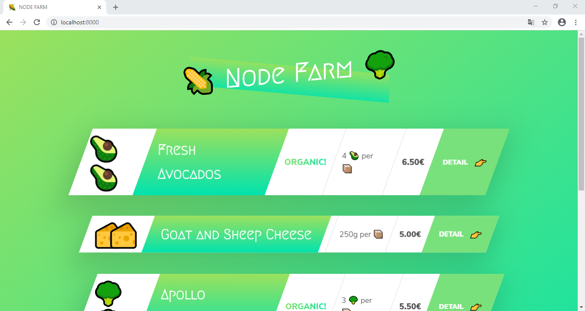

# Node Farm

_Sample webapp made to learn Node.js_

## How to run

-   Open your terminal on root folder and type `npm start`
-   Visit the address `localhost:8000` on your browser

## Features

-   Basic routing
-   API endpoint
-   Custom HTML template engine

## Tools used

-   [Node.js](https://nodejs.org/)

## Note

HTML templates provided by [Jonas Schmedtmann](https://twitter.com/jonasschmedtman)

## License

Read about license rights and limitations [here](LICENSE).
